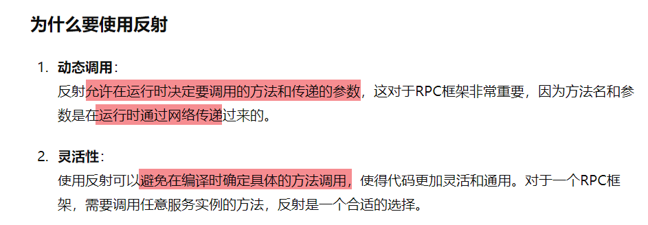
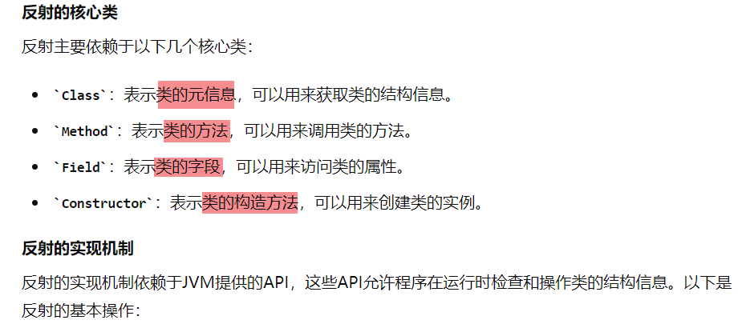
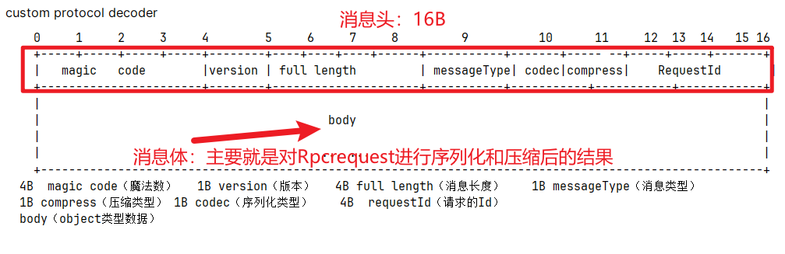
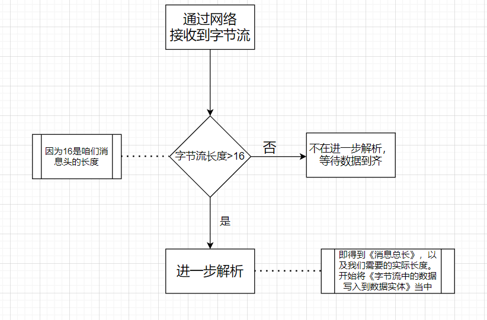
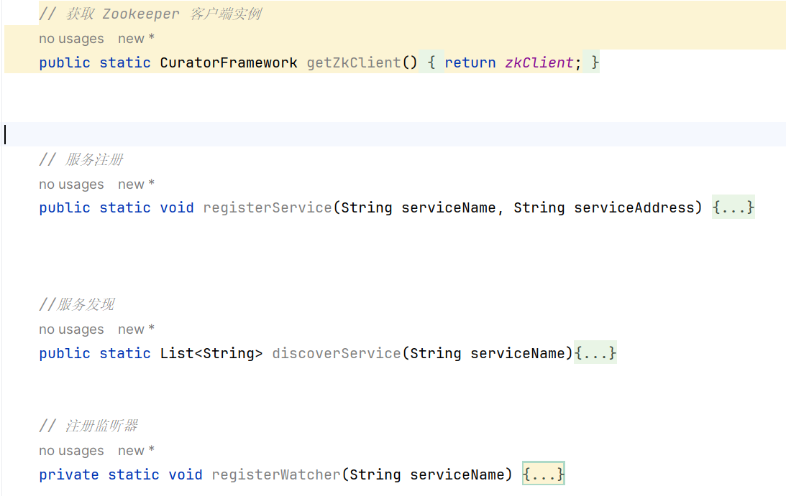
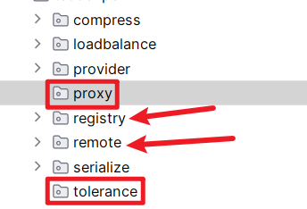

## 本文档用于记录重构过程

### 2024.6.23

> 初始化项目，配置相关模块

### 2024.6.24

> 1.把common模块和rpc框架模块的包结构梳理下
>
> 2.开始rpc：remote：transport：传输实体部分的分析和书写
>
> :green_apple:实体为何要这么设计呢

### 2024.6.25

> 1.完善实体部分
>
> 2.梳理remote:transport:Netty:clint端代码

### 2024.6.26

> 1.Netty-client完成，明日争取完成Netty服务端代码

### 2024.6.27

> ### 思考问题1：
>
> RPC项目要不要依赖Spring框架提供的特性? 确实可以考虑做些`双版本`的内容。`独立版本要求轻量级`，可插拔式。那`Spring版本`则是更好的`集成在Spring应用`当中以作处理。
>
> ### 思考问题2：
>
> 服务端本地服务缓存的必要性？ 1.`防止重复注册`相同服务  2.`存储服务`信息，可以直接`调用相关服务来回应RpcRequest`。服务端的主要职责是提供服务并将`服务注册到服务注册中心`，而客户端则负责`发现服务并进行负载均衡`。在这种设计中，服务端确实不需要在本地维护多个实例的详细信息，只需要确保每个实例都能正确注册到注册中心
>
> ### :green_apple: 思考问题3：
>
> 服务端是根据RpcRequst的信息，然后通过**`反射`**来调用相关服务的，然后返回数据客户端
>
>  
>
> 如果不用反射的话，就得直接把调用具体方法的逻辑确定下来，性能比较高，但是不够灵活。`TODO:反射为什么会慢呢？`
>
>  
>
> Netty服务端和客服端发送消息失败各会是什么操作呢？都是会关闭相应通道的

### 2024.6.28

> 今天梳理编解码器的部分
>
> ### 编码器
>
>  
>
> 消息长度=消息头+消息体。把这个写入到字节流中，接收方就可以通过这个进行正确的解析了
>
> 注意：如果是心跳消息，则只有消息头哦{7个字段}，消息体没有进行传输，而是在编码器那里直接摄入Ping或Pong作为Data
>
> ### 解码器
>
> 主要解决**`TCP拆包和粘包`**的问题,又有了新的理解
>
> #### 1.问题产生：:green_apple:TODO:具体可以再研究下
>
> 源于TCP是基于流的传输方式，无法进行消息边界区分[使用窗口带来的效应吧]
>
> #### 2.解决办法
>
> 解决拆包和粘包问题的核心是什么，能够区分**`数据消息之间的边界`**的即可(即消息1:hello  消息2:world。精确的得到这两个消息即可)。
>
> 像Netty自带的编解码器提供了几种方式来实现：
>
> - 1.固定消息长度，这比较好理解，但缺点就是不适用，你咋直到这个长度规定多少合适呢？
> - 2.在消息后面加分隔符，缺点在于如果传递的数据里面包含分隔符怎么办，那就会出现错误
> - 3.把数据分为消息头和消息体，消息头中给定消息的总长度[消息头+消息体]，这样不就可以区分我们需要的消息长什么样了吗
>
> 本框架自定义的编解码器就继承了方法3,逻辑如下图所示
>
>  

数据传输部分基本理清楚了，接下来开始服务注册与发现部分的内容。

### 2024.6.29

> 首先是完成对注册中心（Zookeeper）工具类的编写，包括【连接注册中心，服务注册，服务发现等方法】TODO:监听器的实现机制再理解以下
>
>  

### 2024.6.30

> 服务注册与发现的部分OK,接下来再考虑下容错层以及代理层。拓展方面可以考虑SPI+结合Spring框架
>
> 我个人修改的主要包括容错层，注册中心的处理{改为临时节点}，做两版[有无结合Spring]
>
>  
